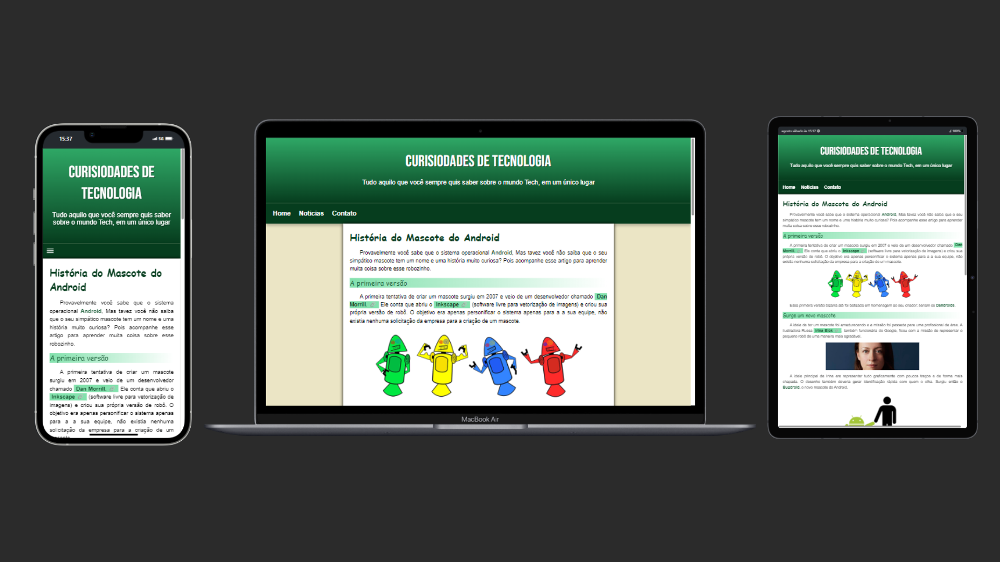

<h1># História do Mascote do Android</h1>

Este projeto é um site informativo que conta a história do mascote do sistema operacional Android. 
Ele apresenta de forma clara e concisa a origem do simpático robozinho verde e curiosidades sobre as versões do sistema.

  
  

<h2>## Tecnologias Utilizadas</h2>

* **HTML5:** Estrutura básica da página.
* **CSS3:** Estilização da página, incluindo responsividade.
* **JavaScript:** Cria interatividade no menu.
* **Google Fonts:** Fontes utilizadas no projeto.
* **Imagens:** Para ilustrar o conteúdo.

<h2>## Estrutura do Projeto</h2>

<h3>O projeto está organizado da seguinte forma:</h3>

* **index.html:** Arquivo principal da página.
* **style.css:** Arquivo de estilo principal.
* **media-query.css:** Arquivo de estilo para responsividade.
* **imagens:** Pasta contendo as imagens utilizadas.

<h2>## Funcionalidades</h2>

* **Responsivo:** O site se adapta a diferentes tamanhos de tela.
* **Menu responsivo:** O menu se esconde em telas menores e é exibido ao clicar no ícone de menu.
* **Conteúdo informativo:** Apresenta a história do mascote do Android de forma clara e concisa.
* **Visualmente atraente:** Utiliza imagens e formatação para tornar a leitura mais agradável.

<h2>## Licença</h2>

Licença Mit

<h1>Demostração</h1>

Você pode ver o projeto <a href="https://edilano-gonzaga.github.io/projeto-android/" target="_blank">Clicando aqui</a>

<h1>Autor</h1>

Edilano Melo

